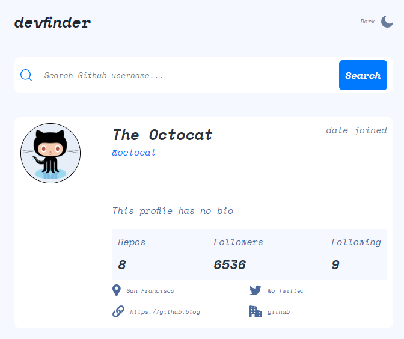
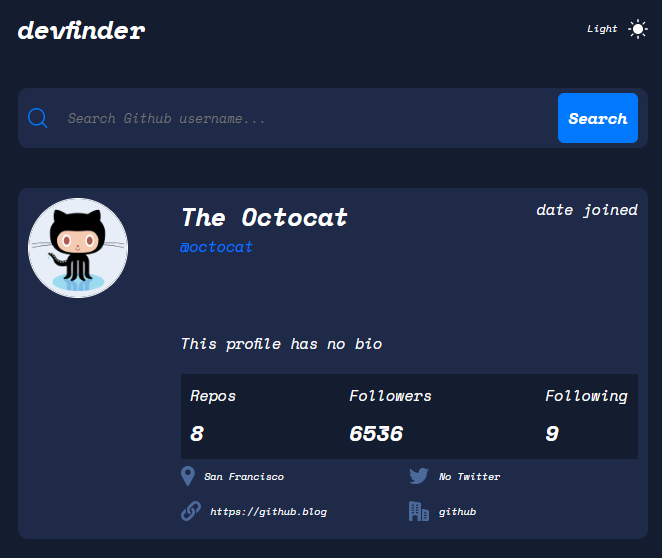
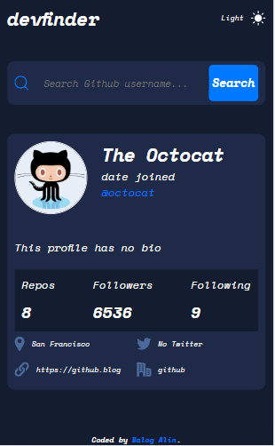

# Github search user app

## Table of contents

- [Overview](#overview)
  - [Screenshot](#screenshot)
  - [Links](#links)
- [My process](#my-process)
  - [Built with](#built-with)
  - [What I learned](#what-i-learned)
  - [Continued development](#continued-development)
- [Author](#author)

## Overview

### Screenshot

### Links

- Solution URL: [github](https://github.com/Fabzus/GIthub-Serach-App)
- Live Site URL: [github](https://fabzus.github.io/GIthub-Serach-App/)

## My process

### Built with

- Semantic HTML5 markup
- CSS custom properties
- Flexbox
- Media query
- REST API
- JavaScript
- All vanilla
- Git

### What I learned

- better understanding of REST API

- i used git bash alone to upload this repo

### Continued development

I will most likely make it a React or Angular app in the near future

## Author

- Balog Alin
- linkedIn - [@alinbalog](https://www.linkedin.com/in/alinbalog/)
- github - [@Fabzus](https://github.com/Fabzus)
- Frontend Mentor - [@Fabzus](https://www.frontendmentor.io/profile/Fabzus)
